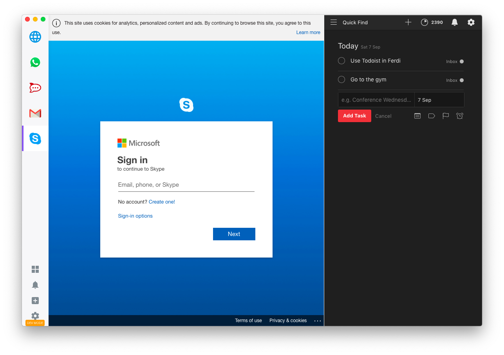

<p align="center">
    
</p>

# Ferdi 

🤴🏽 Hard-fork of [Franz](https://github.com/meetfranz/franz), adding awesome features and removing unwanted features.

## Features
- [x] Removes the counter-productive fullscreen app delay inviting users to upgrade
- [x] Removes pages begging you to donate after registration
- [x] Remove "Franz is better together" popup
- [x] Makes all users Premium by default
- [x] [Makes it possible to edit the "Franz Todo" server](#franz-todo)
- [x] [Add option to change server to a custom](#servers) [ferdi-server](https://github.com/vantezzen/ferdi-server)
- [x] Add "Private Notification"-Mode, that hides message content from notifications (as suggested in [meetfranz/franz#879](https://github.com/meetfranz/franz/issues/879))
- [x] Makes RocketChat self-hosted generally available
- [x] Comes with a custom branding proper to Ferdi

### Servers
Ferdi adds the option to change your Ferdi server. By default, this will be `https://api.franzinfra.com` - the official Franz server. This allows Ferdi to stay compatible with your current Franz account.

If you want to experience all Ferdi features, you may want to use a custom [ferdi-server](https://github.com/vantezzen/ferdi-server). ferdi-server allows you to use Premium features without restrictions and adds the ability to package and add additional recipes. You can also import your existing Franz account into your ferdi-server to start right where you left off.

More information on how to set up a ferdi-server can be found at <https://github.com/vantezzen/ferdi-server/blob/master/README.md>.

### Franz Todo
Starting with Franz 5.3.0, Franz ships with the "Franz Todo" feature. This feature allows you to create a Franz Todo list that stays open at all times.

Ferdi makes it possible to change the Franz Todo list server to any URL you want, e.g. to `todoist.com` to use your Todoist todo list in Franz todo.



## Packaging

```bash
$ npm install
$ npm run build
```

Deliverables will be available in the `./out` folder.

## Developing
### Preparations
- [Install Linux dependencies](docs/linux.md) if you are developing on Linux
- Make sure you are running NodeJS v10. Versions above will throw an errow when trying to install due to an [old fsevent dependency](https://github.com/fsevents/fsevents/issues/278)

### Setup
1. Fix native modules to match current electron node version
    ```
    npm run rebuild
    ```
2. Install dependencies using lerna
    ```
    npx lerna bootstrap
    ```
3. Run Ferdi Development App
    Run these two commands *simultaneously* in different console tabs.
    ```
    npm run dev
    npm run start
    ```

## Releases

You can find the binaries for Linux, MacOS and Windows in the [latest release](https://github.com/kytwb/Ferdi/releases/tag/Ferdi-5.2.0-beta.3) assets. Assets are continuously delivered through [Travis](https://travis-ci.org/kytwb/Ferdi) for Linux/MacOS and [Appveyor](https://ci.appveyor.com/project/kytwb/Ferdi) for Windows.

## Contributors ✨

Thanks goes to these wonderful people ([emoji key](https://allcontributors.org/docs/en/emoji-key)):
<!-- ALL-CONTRIBUTORS-LIST:START - Do not remove or modify this section -->
<!-- prettier-ignore-start -->
<!-- markdownlint-disable -->
<table>
  <tr>
    <td align="center"><a href="https://twitter.com/kytwb"><br /><sub><b>Amine Mouafik</b></sub></a><br /><a href="#question-kytwb" title="Answering Questions">💬</a> <a href="https://github.com/kytwb/ferdi/commits?author=kytwb" title="Code">💻</a> <a href="https://github.com/kytwb/ferdi/commits?author=kytwb" title="Documentation">📖</a> <a href="#ideas-kytwb" title="Ideas, Planning, & Feedback">🤔</a> <a href="#maintenance-kytwb" title="Maintenance">🚧</a> <a href="#platform-kytwb" title="Packaging/porting to new platform">📦</a> <a href="#projectManagement-kytwb" title="Project Management">📆</a> <a href="#review-kytwb" title="Reviewed Pull Requests">👀</a></td>
    <td align="center"><a href="https://vantezzen.io"><br /><sub><b>Bennett</b></sub></a><br /><a href="https://github.com/kytwb/ferdi/commits?author=vantezzen" title="Code">💻</a> <a href="#design-vantezzen" title="Design">🎨</a> <a href="https://github.com/kytwb/ferdi/commits?author=vantezzen" title="Documentation">📖</a> <a href="#ideas-vantezzen" title="Ideas, Planning, & Feedback">🤔</a> <a href="#translation-vantezzen" title="Translation">🌍</a></td>
    <td align="center"><a href="http://www.adlk.io"><br /><sub><b>Stefan Malzner</b></sub></a><br /><a href="https://github.com/kytwb/ferdi/commits?author=adlk" title="Code">💻</a> <a href="#content-adlk" title="Content">🖋</a> <a href="#design-adlk" title="Design">🎨</a> <a href="https://github.com/kytwb/ferdi/commits?author=adlk" title="Documentation">📖</a> <a href="#ideas-adlk" title="Ideas, Planning, & Feedback">🤔</a> <a href="#infra-adlk" title="Infrastructure (Hosting, Build-Tools, etc)">🚇</a> <a href="#projectManagement-adlk" title="Project Management">📆</a> <a href="https://github.com/kytwb/ferdi/commits?author=adlk" title="Tests">⚠️</a> <a href="#translation-adlk" title="Translation">🌍</a></td>
  </tr>
</table>

<!-- markdownlint-enable -->
<!-- prettier-ignore-end -->
<!-- ALL-CONTRIBUTORS-LIST:END -->

<!-- ALL-CONTRIBUTORS-LIST:START - Do not remove or modify this section -->
<!-- prettier-ignore-start -->
<!-- markdownlint-disable -->
<!-- markdownlint-enable -->
<!-- prettier-ignore-end -->
<!-- ALL-CONTRIBUTORS-LIST:END -->

This project follows the [all-contributors](https://github.com/all-contributors/all-contributors) specification. Contributions of any kind welcome!
