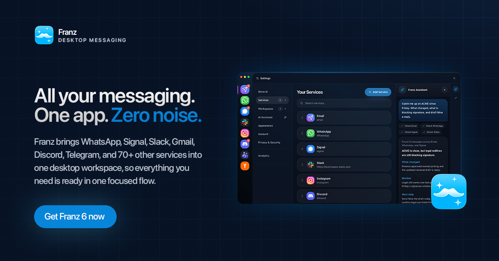
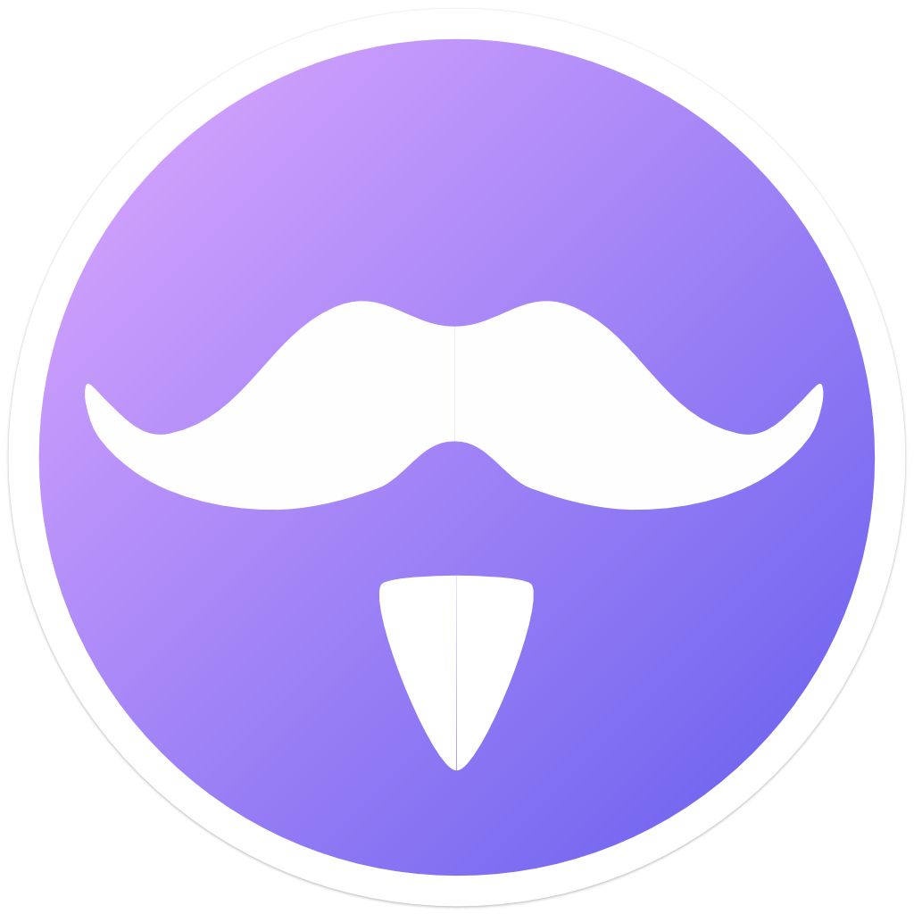

<a href="https://meetfranz.com">
  
</a>

# Franz 6 is here

**One app for every conversation.** Franz 6 brings WhatsApp, Slack, Telegram, Discord,
Gmail, Outlook, Teams and **70+ services** into one focused desktop window — so you stop
paying the app-switching tax and never miss the message that matters.

**New since Franz 5:**

- 🔵 **Native Signal** — a real desktop client, not a wrapped web page
- ✉️ **Franz Mail** — built-in email with priority sorting, smart replies and semantic search
- 🤖 **Franz Assistant** — catches you up across every channel and drafts your next reply, running fully local, in the EU cloud, or on your own API key
- 🛡️ **Privacy Shield** — blocks trackers and fingerprinting scripts inside your services

Plus everything Franz already did well — split view, multi-account, hibernation, themes
and sync — on Mac, Windows and Linux.

Trusted with **1,000,000+ downloads since 2016**, built in Vienna, featured by *Lifehacker*
and *Wired*. Free to use — Franz Pro from €5/month or a one-time lifetime license.

### 👉 [Get Franz 6 at meetfranz.com](https://meetfranz.com)

---

> **ℹ️ About this repository**
> This repo holds **Franz 5**, the open-source predecessor of Franz 6. It is no longer the
> active product, but the source below remains available under Apache-2.0 for reference and
> self-building. For the current app, see [meetfranz.com](https://meetfranz.com).



# Franz 5
[](https://ci.appveyor.com/project/adlk/franz/branch/master)
 [](https://travis-ci.com/meetfranz/franz) [](https://meetfranz.com/payment.html)

Messaging app for WhatsApp, Slack, Telegram, HipChat, Hangouts and many many more.

## [Download Franz](https://www.meetfranz.com)
👉 www.meetfranz.com

### Or use homebrew (macOS only)

`$ brew cask install franz`

(Don't know homebrew? [brew.sh](https://brew.sh/))

## Development

### Preparations

#### Install Linux OS dependencies
[Guide: Linux distribution specific dependencies](docs/linux.md)

#### Fix native modules to match current electron node version
```bash
$ npm run rebuild
```

### Install dependencies
Run the following command to install all dependencies, and link sibling modules with Franz.
```bash
$ npx lerna bootstrap
```

If you previously ran `npm install` it sometimes is necessary to delete your `node_modules` folder before running `npx lerna bootstrap`. 

### Run Franz Development App
Run these two commands __simultaneously__ in different console tabs.

```bash
$ npm run dev
$ npm run start
```
Be aware that the development database will be reset regularly.

## Packaging
```bash
$ npm run build
```

## How can I support the project?
If you have found a bug that hasn't been reported yet or want to request a new feature, please open a new issue.

## I need help?
Join the Franz community on [Slack](http://slack.franz.im) and get in touch with us.

## Create your own plugins/recipes
You can find all the Information at the [Plugins repository](https://github.com/meetfranz/plugins).
For questions feel free to ask in the [community Slack](http://slack.franz.im)

## License
Franz 5 is open-source licensed under the Apache-2.0 License.
